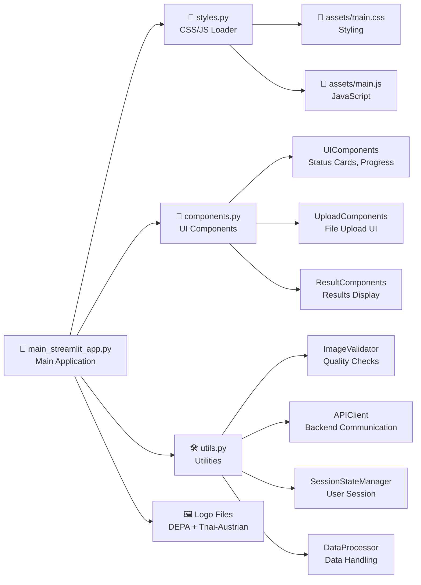
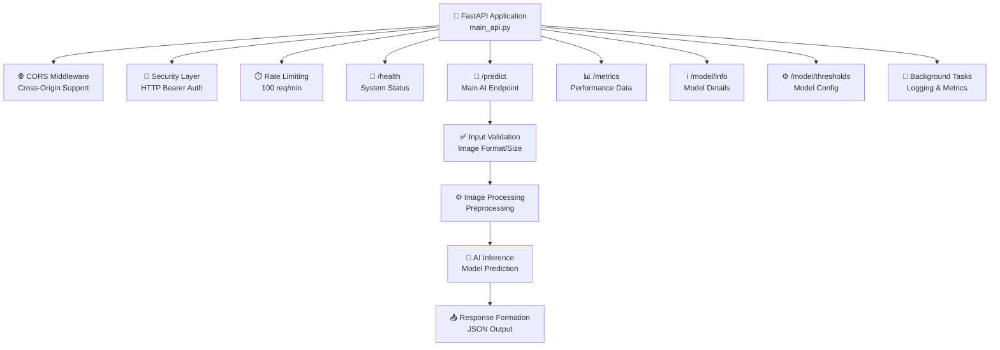
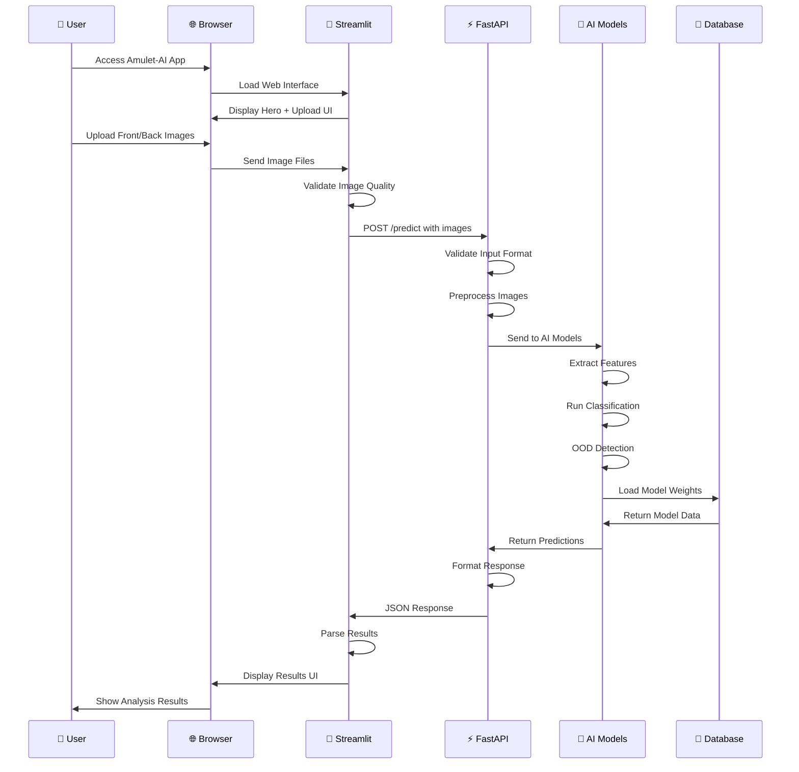
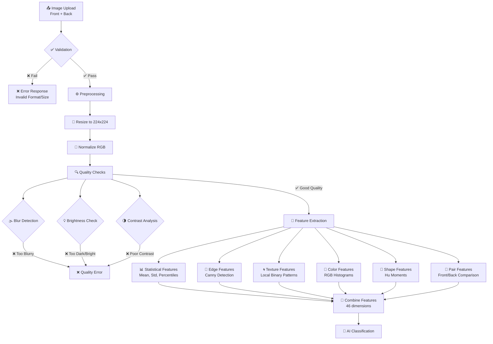
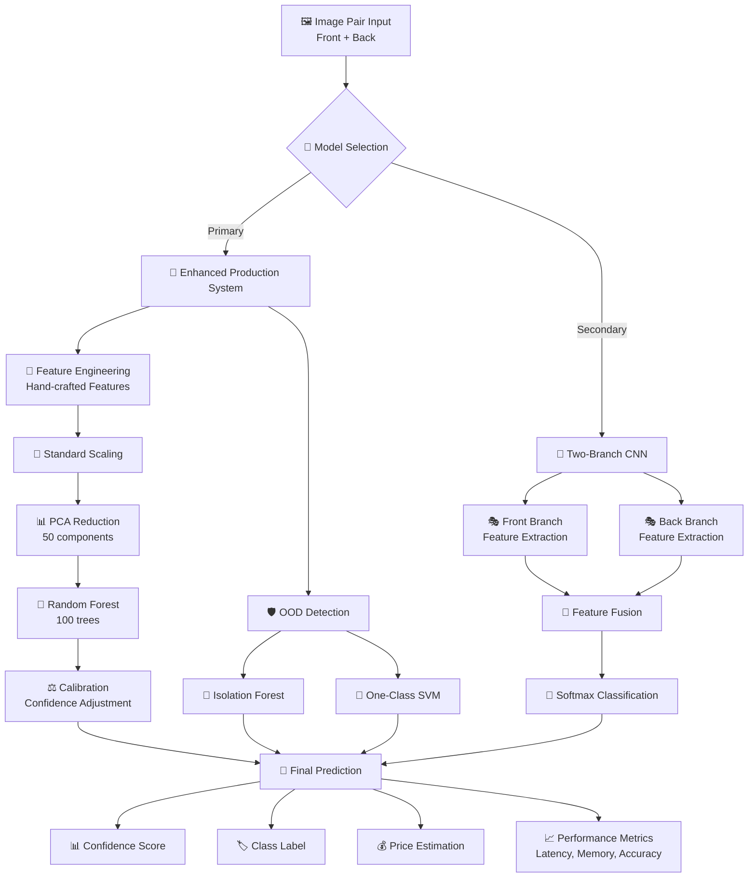
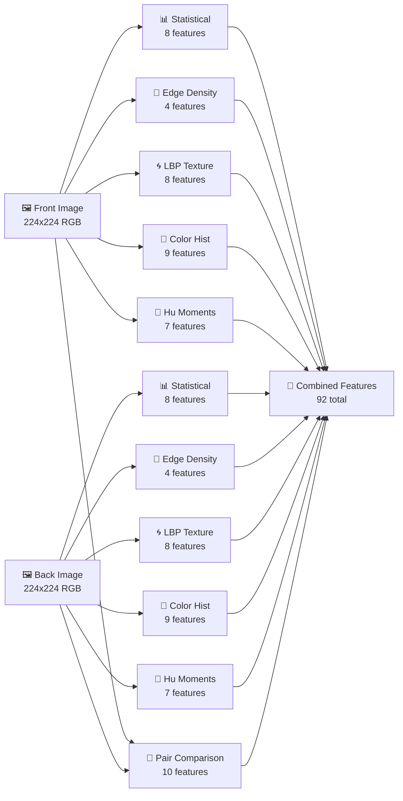
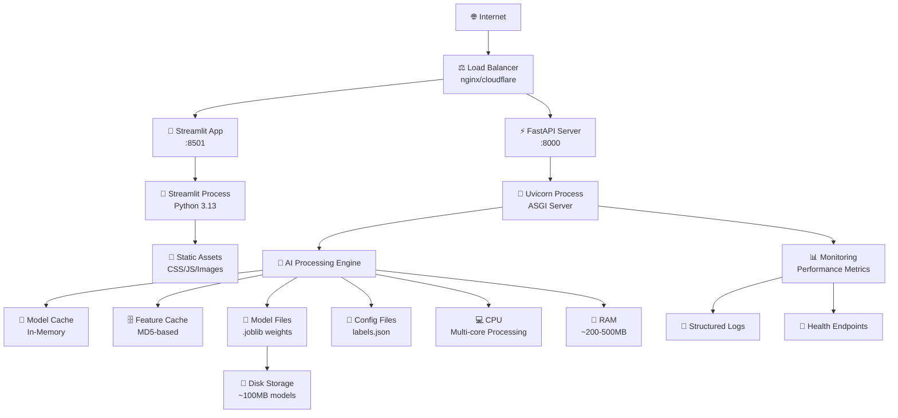
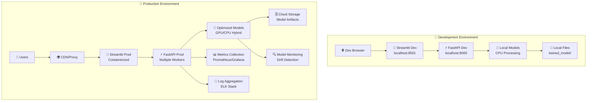
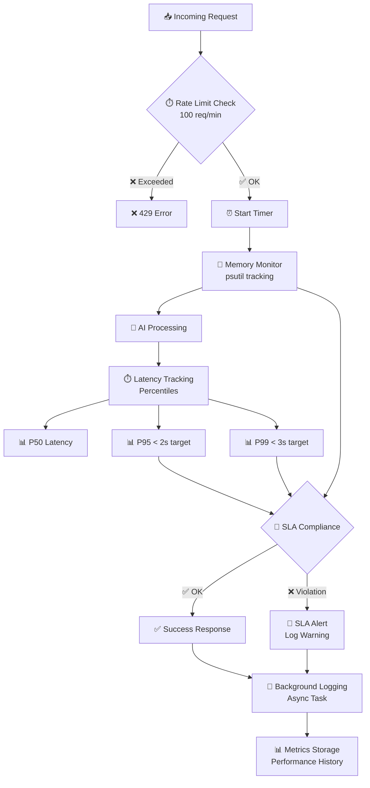
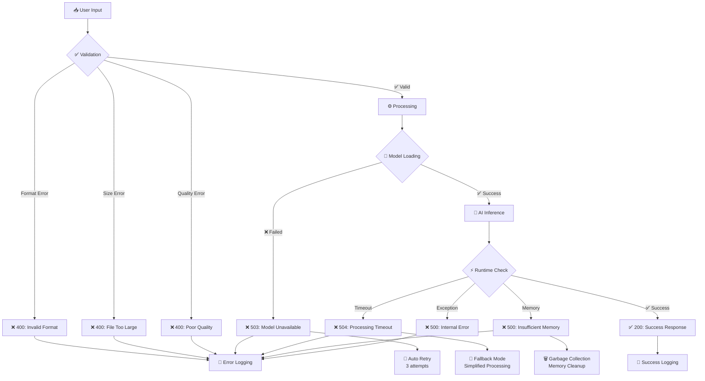

# 🏗️ Amulet-AI Architecture & Workflow Diagram

## 📋 Table of Contents
1. [High-Level System Architecture](#high-level-system-architecture)
2. [Detailed Component Workflow](#detailed-component-workflow)
3. [Data Flow Pipeline](#data-flow-pipeline)
4. [AI Processing Pipeline](#ai-processing-pipeline)
5. [Deployment Architecture](#deployment-architecture)

---

## 🏛️ High-Level System Architecture

```mermaid
graph TB
    %% User Layer
    User[👤 User] --> Browser[🌐 Web Browser]
    
    %% Frontend Layer
    Browser --> Streamlit[🎨 Streamlit Frontend<br/>Port 8501]
    
    %% Backend Layer  
    Streamlit --> FastAPI[⚡ FastAPI Backend<br/>Port 8000]
    
    %% AI Processing Layer
    FastAPI --> AIModels[🧠 AI Models Package]
    
    %% Model Components
    AIModels --> Enhanced[🎯 Enhanced Production<br/>RandomForest + OOD]
    AIModels --> TwoBranch[🔀 Two-Branch CNN<br/>PyTorch Model]
    AIModels --> Compatibility[🔧 Compatibility Loader<br/>Legacy Support]
    
    %% Data Storage
    Enhanced --> TrainedModels[💾 Trained Models<br/>(.joblib files)]
    TwoBranch --> TrainedModels
    
    %% Configuration
    AIModels --> Labels[📋 Labels & Config<br/>(labels.json)]
    
    %% Styling Assets
    Streamlit --> Assets[🎨 Frontend Assets<br/>(CSS/JS)]
    
    %% Response Flow
    FastAPI --> Streamlit
    Streamlit --> Browser
    Browser --> User
    
    %% Styling
    classDef userLayer fill:#e1f5fe
    classDef frontendLayer fill:#f3e5f5
    classDef backendLayer fill:#e8f5e8
    classDef aiLayer fill:#fff3e0
    classDef dataLayer fill:#fce4ec
    
    class User,Browser userLayer
    class Streamlit,Assets frontendLayer
    class FastAPI backendLayer
    class AIModels,Enhanced,TwoBranch,Compatibility aiLayer
    class TrainedModels,Labels dataLayer
```

---

## 🔄 Detailed Component Workflow

### 1. Frontend Component Architecture


### 2. Backend API Architecture


---

## 🚀 Data Flow Pipeline

### User Interaction Flow


### Image Processing Pipeline


---

## 🤖 AI Processing Pipeline

### Dual Model Architecture


### Feature Extraction Detail


---

## 🚀 Deployment Architecture

### Production Deployment


### Development vs Production


---

## 📊 Performance & Monitoring Flow



---

## 🔄 Error Handling & Recovery



---

## 📝 File Structure Mapping

```
🏗️ Amulet-AI Architecture
├── 🎨 Frontend Layer (Streamlit)
│   ├── main_streamlit_app.py    → Main UI Controller
│   ├── components.py            → Reusable UI Components  
│   ├── styles.py                → CSS/JS Asset Loader
│   ├── utils.py                 → Utilities & Validation
│   └── assets/                  → Static CSS/JS Files
│       ├── main.css            → Thai-inspired Styling
│       └── main.js             → Interactive Features
│
├── ⚡ Backend Layer (FastAPI)  
│   ├── main_api.py             → REST API Server
│   └── __init__.py             → Package Initialization
│
├── 🧠 AI Models Layer
│   ├── enhanced_production_system.py  → Random Forest + OOD
│   ├── compatibility_loader.py        → Legacy Model Support
│   ├── labels.json                    → Class Definitions
│   └── twobranch/                     → CNN Architecture
│       ├── model.py            → PyTorch Model Definition
│       ├── inference.py        → Model Inference Engine
│       ├── config.py          → Hyperparameters
│       └── [other modules]    → Training/Preprocessing
│
├── 💾 Trained Models
│   ├── classifier.joblib       → Main Random Forest
│   ├── ood_detector.joblib    → Outlier Detection
│   ├── scaler.joblib          → Feature Scaling
│   ├── pca.joblib             → Dimensionality Reduction
│   └── label_encoder.joblib   → Label Encoding
│
└── 📋 Configuration
    ├── requirements.txt        → Dependencies
    ├── README.md              → Documentation
    └── .gitignore            → Version Control
```

---

---

## 📚 Library Functions & Responsibilities

### 🌐 **Web Framework & API Libraries**
```python
fastapi>=0.110.0          # 🚀 Modern async web framework
```
**หน้าที่**: 
- สร้าง REST API endpoints (`/predict`, `/health`, `/metrics`)
- จัดการ HTTP requests/responses
- Support async processing สำหรับ high concurrency
- Built-in data validation และ automatic API documentation

```python
uvicorn>=0.29.0           # ⚡ ASGI server
```
**หน้าที่**:
- รัน FastAPI application
- Handle multiple concurrent connections
- Auto-reload during development
- Production-grade performance optimization

```python
pydantic>=1.10.13         # ✅ Data validation
```
**หน้าที่**:
- Validate API input/output schemas
- Type checking และ automatic serialization
- Generate API documentation
- Error handling สำหรับ invalid data

```python
streamlit                 # 🎨 Frontend framework (inferred)
```
**หน้าที่**:
- สร้าง web interface สำหรับ users
- File upload functionality
- Interactive widgets และ progress bars
- Real-time updates และ state management

---

### 🧮 **Scientific Computing & Machine Learning**
```python
numpy>=1.24.0             # 🔢 Numerical computing foundation
```
**หน้าที่**:
- Multi-dimensional array operations
- Mathematical functions (mean, std, percentiles)
- Image data manipulation (pixel arrays)
- Linear algebra operations สำหรับ ML

```python
scikit-learn>=1.3.0       # 🤖 Machine learning algorithms
```
**หน้าที่**:
- **RandomForestClassifier**: Main classification model
- **StandardScaler**: Feature normalization
- **PCA**: Dimensionality reduction (50 components)
- **LabelEncoder**: Convert class names to numbers
- **IsolationForest + OneClassSVM**: Out-of-domain detection
- **CalibratedClassifierCV**: Confidence calibration
- **Metrics**: Accuracy, F1-score, confusion matrix

```python
joblib>=1.3.2             # 💾 Model persistence
```
**หน้าที่**:
- Save/load trained models (`.joblib` files)
- Efficient serialization สำหรับ sklearn objects
- Parallel processing support
- Memory-efficient model storage

```python
pandas>=2.0.3             # 📊 Data manipulation
```
**หน้าที่**:
- Dataset loading และ preprocessing
- Data analysis และ statistics
- Handle structured data (CSV, JSON)
- Data cleaning และ transformation

---

### 🖼️ **Computer Vision & Image Processing**
```python
opencv-python>=4.8.0.76   # 👁️ Computer vision powerhouse
```
**หน้าที่**:
- **Image I/O**: Load/save images
- **Preprocessing**: Resize, color conversion, normalization
- **Quality checks**: Blur detection (Laplacian variance)
- **Feature extraction**: 
  - Canny edge detection
  - Contour detection
  - Histogram analysis
- **Advanced processing**: Morphological operations, filtering

```python
Pillow>=9.5.0             # 🖼️ Python image library
```
**หน้าที่**:
- **Basic image operations**: Open, save, format conversion
- **Image enhancement**: Brightness, contrast, saturation
- **Format support**: JPG, PNG, WebP, HEIC
- **Quality assessment**: Statistical analysis (ImageStat)
- **Filters**: Blur, sharpen, edge enhancement
- **Drawing**: Text, shapes สำหรับ visualization

---

### 🔥 **Deep Learning Framework**
```python
torch>=2.1.0              # 🧠 PyTorch neural networks
```
**หน้าที่**:
- **Two-Branch CNN architecture**: Dual-view processing
- **Neural network layers**: Conv2d, BatchNorm, Dropout
- **Optimization**: Adam, SGD optimizers
- **GPU acceleration**: CUDA support
- **Model training**: Backpropagation, gradient computation
- **Inference**: Forward pass สำหรับ predictions

```python
torchvision>=0.16.0       # 👀 Computer vision for PyTorch
```
**หน้าที่**:
- **Pre-trained models**: MobileNet, EfficientNet backbones
- **Image transforms**: Resize, normalize, augmentation
- **Data loading**: ImageFolder, DataLoader utilities
- **Transfer learning**: Feature extraction จาก pre-trained models

---

### ⚡ **Performance & System Monitoring**
```python
psutil>=5.9.5             # 📊 System performance monitoring
```
**หน้าที่**:
- **Memory tracking**: RAM usage monitoring
- **CPU utilization**: Process performance
- **Real-time metrics**: For SLA compliance
- **Resource management**: Memory cleanup, optimization
- **System health**: Disk, network usage

```python
faiss-cpu>=1.7.4          # 🔍 Fast similarity search
```
**หน้าที่**:
- **Vector similarity**: Fast nearest neighbor search
- **Feature matching**: Compare extracted features
- **Efficient indexing**: Large-scale similarity computation
- **Memory optimization**: CPU-optimized algorithms

---

### 🔧 **Python Standard Libraries (Built-in)**

#### **System & File Operations**
```python
import os                 # 🗂️ Operating system interface
```
**หน้าที่**: Environment variables, file paths, directory operations

```python
import sys                # ⚙️ System-specific parameters
```
**หน้าที่**: Python path manipulation, exit codes, interpreter settings

```python
from pathlib import Path  # 📁 Modern path handling
```
**หน้าที่**: Object-oriented file paths, cross-platform compatibility

```python
import logging            # 📝 Structured logging
```
**หน้าที่**: Error tracking, debug information, performance logging

#### **Data Handling & Serialization**
```python
import json               # 📋 JSON data format
```
**หน้าที่**: Configuration files, API responses, metadata storage

```python
import base64             # 🔐 Binary encoding
```
**หน้าที่**: Image encoding สำหรับ web transfer, secure data transmission

```python
import io                 # 💾 In-memory file operations
```
**หน้าที่**: Handle image bytes, memory-efficient file processing

```python
import hashlib            # 🔑 Hash functions
```
**หน้าที่**: Feature caching (MD5), data integrity, unique identifiers

#### **Time & Performance**
```python
import time               # ⏰ Time operations
```
**หน้าที่**: Performance timing, latency measurement, SLA monitoring

```python
from datetime import datetime  # 📅 Date/time handling
```
**หน้าที่**: Timestamps, logging, user session tracking

#### **Async & Concurrency**
```python
import asyncio            # 🔄 Asynchronous programming
```
**หน้าที่**: Background tasks, concurrent processing, non-blocking operations

```python
import uuid               # 🔖 Unique identifiers
```
**หน้าที่**: Request tracking, session IDs, unique file names

#### **Type Safety & Structure**
```python
from typing import Dict, List, Tuple, Optional, Any
```
**หน้าที่**: Type hints, code documentation, IDE support, error prevention

```python
from dataclasses import dataclass, field, asdict
```
**หน้าที่**: Structured data objects, configuration classes, clean APIs

#### **Data Collections**
```python
from collections import Counter, defaultdict
```
**หน้าที่**: Data analysis, counting operations, specialized dictionaries

---

### 🌐 **Communication Libraries**
```python
import requests           # 🌍 HTTP client
```
**หน้าที่**:
- **API communication**: Frontend ↔ Backend
- **HTTP requests**: GET, POST with files
- **Error handling**: Timeout, connection errors
- **Session management**: Keep-alive connections

---

### 🔒 **Security & Validation**
```python
from fastapi.security import HTTPBearer, HTTPAuthorizationCredentials
```
**หน้าที่**:
- **Authentication**: Bearer token validation
- **API security**: Rate limiting, access control
- **Request validation**: Secure endpoint access

```python
import warnings           # ⚠️ Warning management
```
**หน้าที่**: Suppress non-critical warnings, clean console output

---

### 📊 **Library Usage by Component**

#### **🎨 Frontend (Streamlit)**
- **Core**: `streamlit`, `requests`, `PIL`
- **Data**: `numpy`, `json`, `base64`
- **Utils**: `pathlib`, `datetime`, `typing`

#### **⚡ Backend (FastAPI)**
- **Web**: `fastapi`, `uvicorn`, `pydantic`
- **Processing**: `opencv-python`, `PIL`, `numpy`
- **Monitoring**: `psutil`, `logging`
- **Async**: `asyncio`, `uuid`

#### **🧠 AI Models**
- **ML**: `scikit-learn`, `joblib`, `numpy`
- **Vision**: `opencv-python`, `PIL`
- **DL**: `torch`, `torchvision`
- **Data**: `pandas`, `json`

#### **💾 Data Pipeline**
- **Storage**: `joblib`, `json`, `pathlib`
- **Processing**: `numpy`, `pandas`, `hashlib`
- **Caching**: `faiss-cpu`, `psutil`

---

**🎯 This architecture provides:**
- **Scalable**: Modular design for easy expansion
- **Robust**: Comprehensive error handling & monitoring  
- **Fast**: Optimized for <2s response times
- **User-Friendly**: Intuitive Thai-language interface
- **Production-Ready**: SLA compliance & performance tracking
