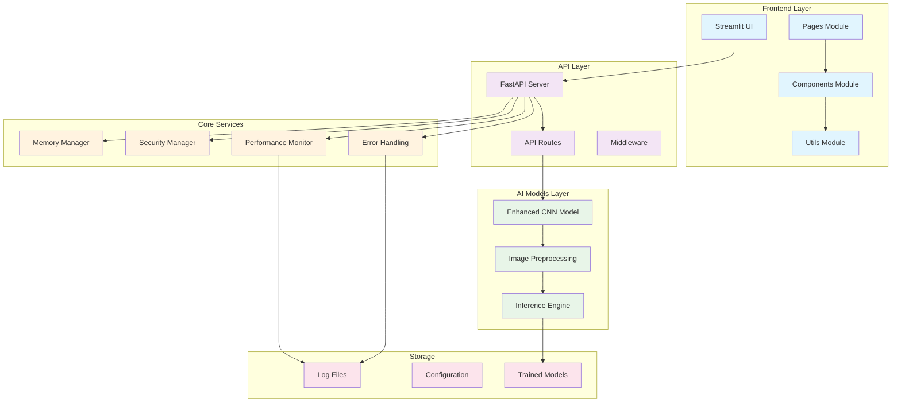
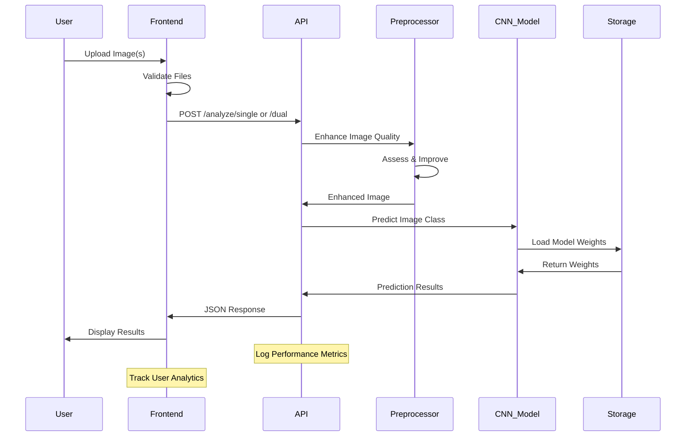
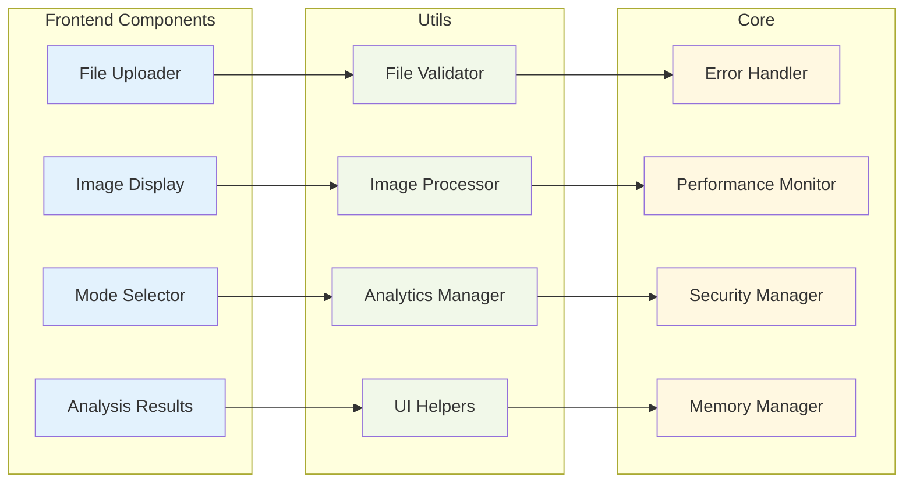
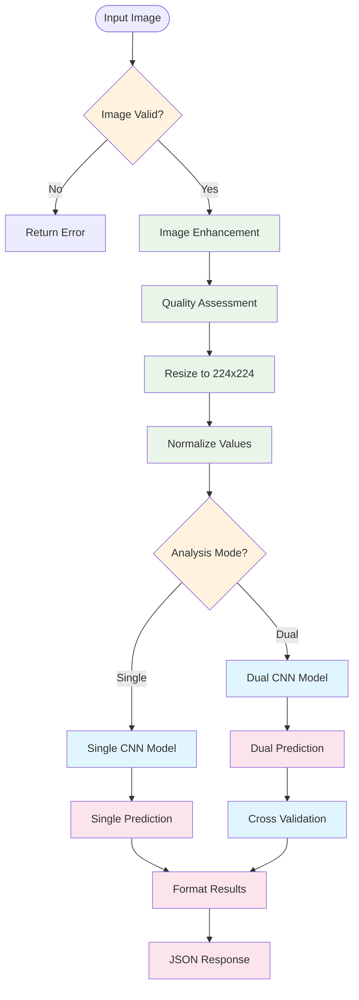
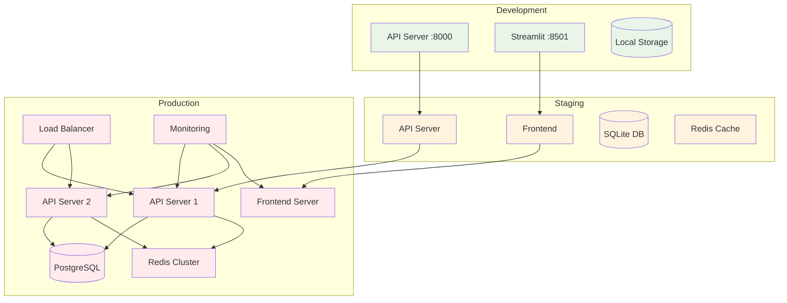
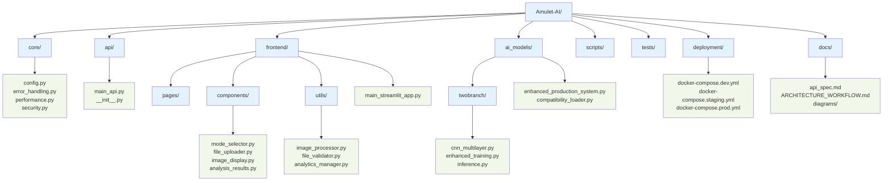

# System Architecture Diagram

## Overall System Architecture

```mermaid
graph TB
    subgraph "Frontend Layer"
        UI[Streamlit UI]
        Pages[Pages Module]
        Components[Components Module]
        Utils[Utils Module]
    end
    
    subgraph "API Layer" 
        API[FastAPI Server]
        Routes[API Routes]
        Middleware[Middleware]
    end
    
    subgraph "AI Models Layer"
        CNN[Enhanced CNN Model]
        Preprocessing[Image Preprocessing]
        Inference[Inference Engine]
    end
    
    subgraph "Core Services"
        ErrorHandler[Error Handling]
        Performance[Performance Monitor]
        Security[Security Manager]
        Memory[Memory Manager]
    end
    
    subgraph "Storage"
        Models[Trained Models]
        Config[Configuration]
        Logs[Log Files]
    end
    
    %% Connections
    UI --> API
    Pages --> Components
    Components --> Utils
    API --> Routes
    Routes --> CNN
    CNN --> Preprocessing
    Preprocessing --> Inference
    API --> ErrorHandler
    API --> Performance
    API --> Security
    API --> Memory
    Inference --> Models
    ErrorHandler --> Logs
    Performance --> Logs
    
    %% Styling
    classDef frontend fill:#e1f5fe
    classDef api fill:#f3e5f5  
    classDef ai fill:#e8f5e8
    classDef core fill:#fff3e0
    classDef storage fill:#fce4ec
    
    class UI,Pages,Components,Utils frontend
    class API,Routes,Middleware api
    class CNN,Preprocessing,Inference ai
    class ErrorHandler,Performance,Security,Memory core
    class Models,Config,Logs storage
```

## Data Flow Diagram

```mermaid
sequenceDiagram
    participant User
    participant Frontend
    participant API
    participant Preprocessor
    participant CNN_Model
    participant Storage
    
    User->>Frontend: Upload Image(s)
    Frontend->>Frontend: Validate Files
    Frontend->>API: POST /analyze/single or /dual
    
    API->>Preprocessor: Enhance Image Quality
    Preprocessor->>Preprocessor: Assess & Improve
    Preprocessor->>API: Enhanced Image
    
    API->>CNN_Model: Predict Image Class
    CNN_Model->>Storage: Load Model Weights
    Storage->>CNN_Model: Return Weights
    CNN_Model->>API: Prediction Results
    
    API->>Frontend: JSON Response
    Frontend->>User: Display Results
    
    Note over API: Log Performance Metrics
    Note over Frontend: Track User Analytics
```

## Component Architecture

```mermaid
graph LR
    subgraph "Frontend Components"
        MS[Mode Selector]
        FU[File Uploader] 
        ID[Image Display]
        AR[Analysis Results]
    end
    
    subgraph "Utils"
        IP[Image Processor]
        FV[File Validator]
        AM[Analytics Manager]
        UH[UI Helpers]
    end
    
    subgraph "Core"
        EH[Error Handler]
        PM[Performance Monitor]
        SM[Security Manager]
        MM[Memory Manager]
    end
    
    MS --> AM
    FU --> FV
    ID --> IP
    AR --> UH
    
    FV --> EH
    IP --> PM
    AM --> SM
    UH --> MM
    
    classDef comp fill:#e3f2fd
    classDef util fill:#f1f8e9
    classDef core fill:#fff8e1
    
    class MS,FU,ID,AR comp
    class IP,FV,AM,UH util
    class EH,PM,SM,MM core
```

## AI Model Pipeline

```mermaid
flowchart TD
    Start([Input Image]) --> Check{Image Valid?}
    Check -->|No| Error[Return Error]
    Check -->|Yes| Enhance[Image Enhancement]
    
    Enhance --> Quality[Quality Assessment]
    Quality --> Resize[Resize to 224x224]
    Resize --> Normalize[Normalize Values]
    
    Normalize --> Mode{Analysis Mode?}
    Mode -->|Single| SingleCNN[Single CNN Model]
    Mode -->|Dual| DualCNN[Dual CNN Model]
    
    SingleCNN --> SinglePred[Single Prediction]
    DualCNN --> DualPred[Dual Prediction]
    DualPred --> CrossVal[Cross Validation]
    
    SinglePred --> Format[Format Results]
    CrossVal --> Format
    Format --> Response[JSON Response]
    
    classDef process fill:#e8f5e8
    classDef decision fill:#fff3e0
    classDef model fill:#e1f5fe
    classDef result fill:#fce4ec
    
    class Enhance,Quality,Resize,Normalize process
    class Check,Mode decision
    class SingleCNN,DualCNN,CrossVal model
    class SinglePred,DualPred,Format,Response result
```

## Deployment Architecture

```mermaid
graph TB
    subgraph "Development"
        DevAPI[API Server :8000]
        DevFrontend[Streamlit :8501]
        DevDB[(Local Storage)]
    end
    
    subgraph "Staging"
        StageAPI[API Server]
        StageFrontend[Frontend]
        StageDB[(SQLite DB)]
        StageCache[Redis Cache]
    end
    
    subgraph "Production"
        ProdLB[Load Balancer]
        ProdAPI1[API Server 1]
        ProdAPI2[API Server 2]
        ProdFrontend[Frontend Server]
        ProdDB[(PostgreSQL)]
        ProdCache[Redis Cluster]
        ProdMonitor[Monitoring]
    end
    
    DevAPI --> StageAPI
    DevFrontend --> StageFrontend
    
    StageAPI --> ProdAPI1
    StageFrontend --> ProdFrontend
    
    ProdLB --> ProdAPI1
    ProdLB --> ProdAPI2
    ProdAPI1 --> ProdDB
    ProdAPI2 --> ProdDB
    ProdAPI1 --> ProdCache
    ProdAPI2 --> ProdCache
    
    ProdMonitor --> ProdAPI1
    ProdMonitor --> ProdAPI2
    ProdMonitor --> ProdFrontend
    
    classDef dev fill:#e8f5e8
    classDef stage fill:#fff3e0
    classDef prod fill:#ffebee
    
    class DevAPI,DevFrontend,DevDB dev
    class StageAPI,StageFrontend,StageDB,StageCache stage
    class ProdLB,ProdAPI1,ProdAPI2,ProdFrontend,ProdDB,ProdCache,ProdMonitor prod
```

## File Structure Diagram

```mermaid
graph TD
    Root[Amulet-AI/] --> Core[core/]
    Root --> API[api/]
    Root --> Frontend[frontend/]
    Root --> AIModels[ai_models/]
    Root --> Scripts[scripts/]
    Root --> Tests[tests/]
    Root --> Docs[docs/]
    Root --> Deploy[deployment/]
    
    Core --> CoreFiles[config.py<br/>error_handling.py<br/>performance.py<br/>security.py]
    
    API --> APIFiles[main_api.py<br/>__init__.py]
    
    Frontend --> FPages[pages/]
    Frontend --> FComponents[components/]
    Frontend --> FUtils[utils/]
    Frontend --> MainApp[main_streamlit_app.py]
    
    FComponents --> CompFiles[mode_selector.py<br/>file_uploader.py<br/>image_display.py<br/>analysis_results.py]
    
    FUtils --> UtilFiles[image_processor.py<br/>file_validator.py<br/>analytics_manager.py]
    
    AIModels --> TwoBranch[twobranch/]
    AIModels --> AIFiles[enhanced_production_system.py<br/>compatibility_loader.py]
    
    TwoBranch --> TBFiles[cnn_multilayer.py<br/>enhanced_training.py<br/>inference.py]
    
    Deploy --> EnvFiles[docker-compose.dev.yml<br/>docker-compose.staging.yml<br/>docker-compose.prod.yml]
    
    Docs --> DocFiles[api_spec.md<br/>ARCHITECTURE_WORKFLOW.md<br/>diagrams/]
    
    classDef folder fill:#e3f2fd
    classDef file fill:#f1f8e9
    
    class Root,Core,API,Frontend,AIModels,Scripts,Tests,Docs,Deploy,FPages,FComponents,FUtils,TwoBranch folder
    class CoreFiles,APIFiles,MainApp,CompFiles,UtilFiles,AIFiles,TBFiles,EnvFiles,DocFiles file
```